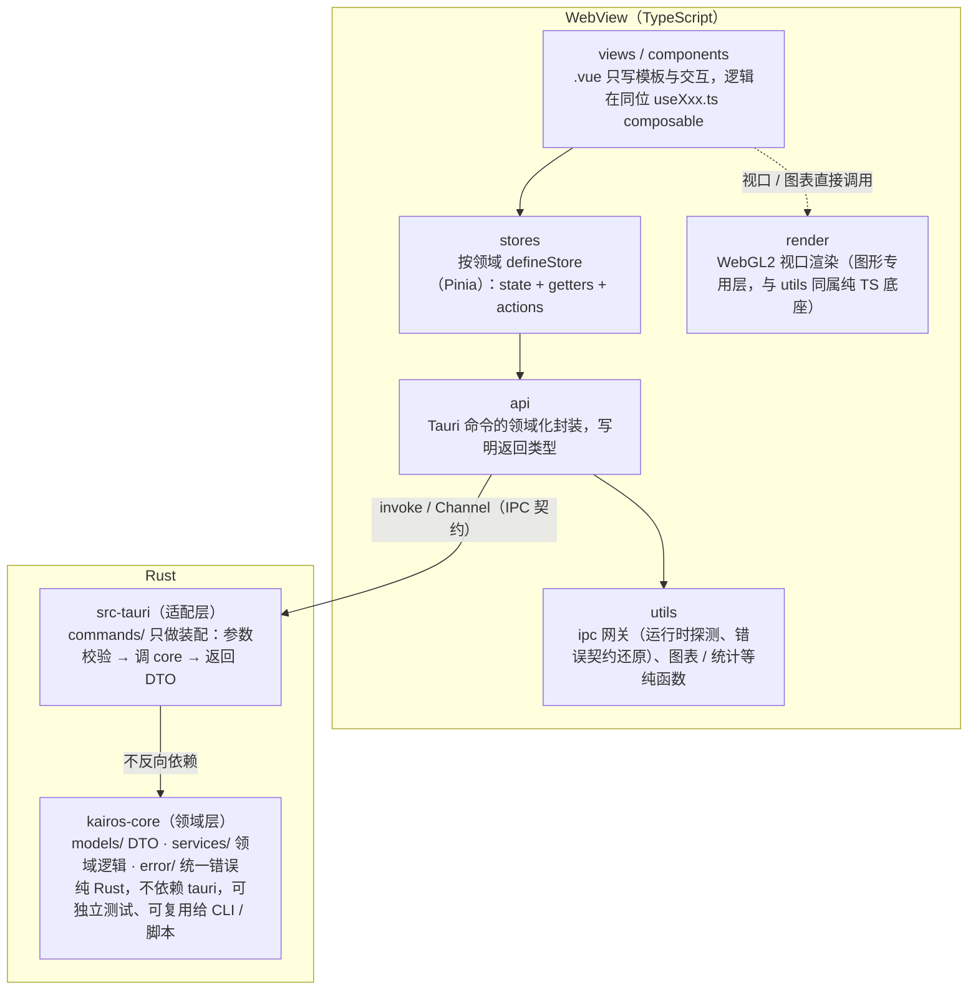
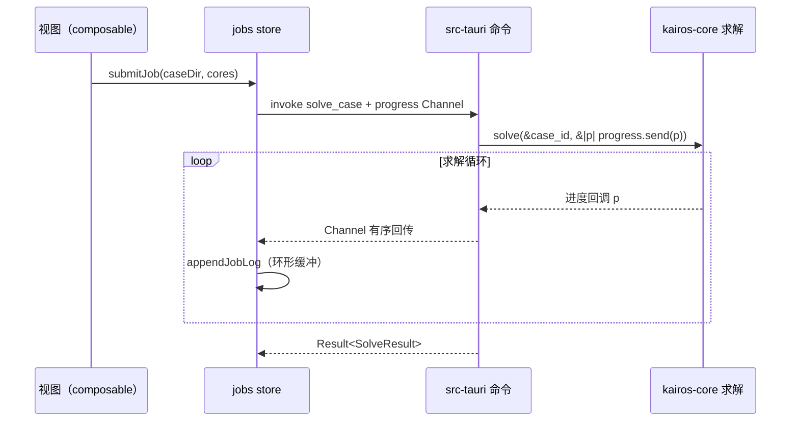

# Kairos 架构约定

> 模块完成度清单（分支勾选状态）见 [architecture-status.md](architecture-status.md)。

本文是 Kairos（注塑成型 CAE 仿真软件）的架构权威文档。所有新代码必须遵守这里的分层与契约；与 README 冲突时以本文为准。

## 1. 总览与依赖方向（铁律）



职责边界的判定标准（去掉 Vue 还能测就进 `.ts`、必须依赖 Vue API 才成立就进
composable、只描述 DOM 就留 `.vue`）与反模式清单见
[web-conventions.md](web-conventions.md)。

两条铁律：

1. **依赖只能向下**：`views / components → stores → api → utils`；Rust 侧 `src-tauri → kairos-core`。`kairos-core` 出现 `use tauri` 即为架构破坏（CI 的 clippy 不会拦，靠 review 把关）。
2. **业务逻辑只住 core**：`src-tauri` 的 commands 不写业务逻辑，只做「参数 → core 调用 → DTO 返回」的装配。这样所有领域代码都能脱离 Tauri 做单元测试，未来也能直接复用给批处理 CLI、Wasm 模块。

## 2. Rust 工作区

```
Cargo.toml               # 工作区根：成员、公共依赖版本、release profile（只能放这里）
src-crates/kairos-core/ # 领域层 crate（纯 Rust）
  src/models/            #   IPC DTO（serde 形状 = 前后端契约）
  src/services/          #   领域服务与计算逻辑（未来的网格/求解器/结果都在这）
  src/error.rs           #   KairosError 统一错误 + IPC 错误契约
  tests/contract.rs      #   契约测试：锁定序列化形状
src-tauri/               # Tauri 适配层 crate
  src/commands/          #   命令适配（每个领域一个模块）
  src/lib.rs             #   Builder 装配：插件、State、generate_handler（注册唯一入口）
  tauri.conf.json
```

拆成两个 crate 的收益：领域代码编译/测试不拖 Tauri 全家桶（后续引入 nalgebra、rayon 等重依赖时差距会非常明显）；`cargo test -p kairos-core` 秒级反馈；为 CLI / Python 绑定等复用留好了门。

## 3. IPC 契约

### DTO

- DTO 定义在 `kairos-core/src/models/`，`#[serde(rename_all = "camelCase")]`；
- 前端在 `src-web/types.ts` 镜像同构类型（一行 Rust 字段对一行 TS 字段）；
- **任何 DTO 改动必须同步两处，并让 `src-crates/kairos-core/tests/contract.rs` 与前端 vitest 双双通过**——契约测试失败即联调会爆错，宁可 here 失败不要上线失败。

### 错误契约

命令一律返回 `kairos_core::error::Result<T>`（即 `Result<T, KairosError>`）。Tauri 官方要求命令错误必须实现 `serde::Serialize`；本项目的稳定错误载荷是：

```json
{ "code": "validation", "message": "参数超出量程" }
```

`code` 取值固定为 `validation / not_found / io / solver / internal`（`ErrorKind`）。前端 `utils/ipc.ts` 把它还原为 `CommandError`（带 `.code` 字段）；UI 按 code 分支，**禁止对 message 做文本匹配**。

### 传输选型

| 场景                            | 机制                                                                    |
| ------------------------------- | ----------------------------------------------------------------------- |
| 请求/响应                       | `invoke` 命令（JSON）                                                   |
| 求解进度、日志流式回传          | `tauri::ipc::Channel`（类型安全、有序、高吞吐，官方推荐，优于事件系统） |
| 大体量二进制（网格/结果场数据） | `tauri::ipc::Response` 原始字节，避免 JSON 序列化开销                   |
| 后端主动广播（全局通知）        | `emit` 事件（仅限无法用 Channel 的场景）                                |

## 4. 命令层规范

### 线程模型（官方语义，写代码前先想清楚）

- **同步命令跑在主线程**——超过几毫秒的计算会卡死 UI；
- `#[tauri::command(async)]` / `async fn` 命令跑在 tokio 线程池；
- CPU 密集的长任务（求解器）在命令里用 `std::thread::spawn` + `Channel` 上报进度，或 `tauri::async_runtime::spawn_blocking`；
- **锁不跨耗时调用**：`State<Mutex<_>>` 的锁只圈住读写时刻，绝不持有锁跑求解。

### 长任务标准模式（进度回传）

```rust
use tauri::ipc::Channel;

#[tauri::command(async)]
fn solve_case(case_id: String, progress: Channel<SolveProgress>) -> Result<SolveResult> {
    // core: 在内部循环里调用回调；适配层把回调桥接到 Channel
    kairos_core::services::solver::solve(&case_id, &|p| {
        let _ = progress.send(p);
    })?;
    // ...
}
```

```ts
import { Channel, invoke } from "@tauri-apps/api/core";

const channel = new Channel<SolveProgress>();
channel.onmessage = (progress) => jobs.appendJobLog(jobId, `进度 ${progress}%`);
await invoke<SolveResult>("solve_case", { caseId, progress: channel });
```



### 新增一个命令的流程

1. core：`models/` 定义 DTO → `services/` 写领域函数（`Result<T, KairosError>`）→ 补单测；
2. 契约：`src-crates/kairos-core/tests/contract.rs` 补序列化断言；
3. 适配：`src-tauri/src/commands/<领域>.rs` 写薄命令；`lib.rs` 的 `generate_handler![]` 注册；
4. 前端：`types/index.ts` 镜像 DTO → `api/` 封装 → `stores/<域>` 加 action
   （失败经 `app.setError`，busy 用 `beginBusy/endBusy` 配对）→ composable 消费；
5. 前端测试：`tests/web/stores/<域>.test.ts` 用 `vi.mock` 覆盖成功/失败两条路径。

## 5. 状态管理

### Rust 侧

- 需要会话内共享的可变状态用 `tauri::Builder::manage(...)` 注册（如项目注册表：`State<'_, ProjectRegistry>`）；
- 容器选择：读多写少用 `RwLock`，写频繁用 `Mutex`；临界区必须极短（本项目用标准库锁，不引入 parking_lot）；
- 能重算的状态不入库：会话状态只存「不可再生的东西」，可从文件重载的数据以文件为准。

### 前端

- 按领域 defineStore（app / project / geometry / materials / jobs / pipeline / results /
  dependencies / vm）：action 是状态的唯一写入口，组件不自改领域状态；
- 响应式追踪由 Pinia 细粒度完成；跨域动作在 action 内引用其他 store；
  `menu-actions.ts` / `global-shortcuts.ts` 在处理器内懒取 store（模块加载早于 `createPinia()`）；
- IPC 不可用（浏览器预览）是预期场景：`IpcUnavailableError` 显示为中性提示并自动消失，与真实失败（红色）区分。

## 6. 测试策略

| 层               | 工具                           | 覆盖点                                 |
| ---------------- | ------------------------------ | -------------------------------------- |
| kairos-core 单测 | `cargo test -p kairos-core`    | 领域逻辑（数值算法对解析解、边界条件） |
| IPC 契约         | `tests/contract.rs` + `vitest` | serde 形状、错误契约、前端状态动作     |
| 适配层           | 保持薄，不专门测               | 逻辑都下沉到 core                      |
| 前端组件         | vitest + happy-dom             | 渲染分支、交互回调                     |

提交前门禁：`bun run verify`（typecheck → clippy(-D warnings) → format → test → knip，前后端全量）。

性能预算与基准：见 [perf-budget.md](perf-budget.md)（T01），所有涉及计算与渲染的任务以其为验收依据。

工程杂项：

- knip 配置里 `tailwindcss` 在 `ignoreDependencies` 中：它通过 `@tailwindcss/vite` 的 peer 依赖和 CSS `@import` 生效，knip 静态分析识别不到；
- `bun.lock` 与根 `Cargo.lock` 是提交入库的文本锁文件，勿加入 ignore；
- husky pre-commit 在每次 `git commit` 时自动执行 `bun run verify`，克隆后 `bun install` 经 `prepare` 脚本自动初始化钩子。

## 7. 参考文献

- Tauri 官方：Calling Rust from the Frontend（命令、线程模型、错误处理、State）— <https://v2.tauri.app/develop/calling-rust/>
- Tauri 官方：Calling the Frontend from Rust（Channel 流式回传）— <https://v2.tauri.app/develop/calling-frontend/>
- Tauri 官方：Inter-Process Communication 概念 — <https://v2.tauri.app/concept/inter-process-communication/>
- Tauri 官方讨论：多类错误的处理共识 — <https://github.com/orgs/tauri-apps/discussions/5008>
- Tauri 错误处理实践（thiserror + Serialize 模式）— <https://tbt.qkation.com/posts/tauri-error-handling/>
