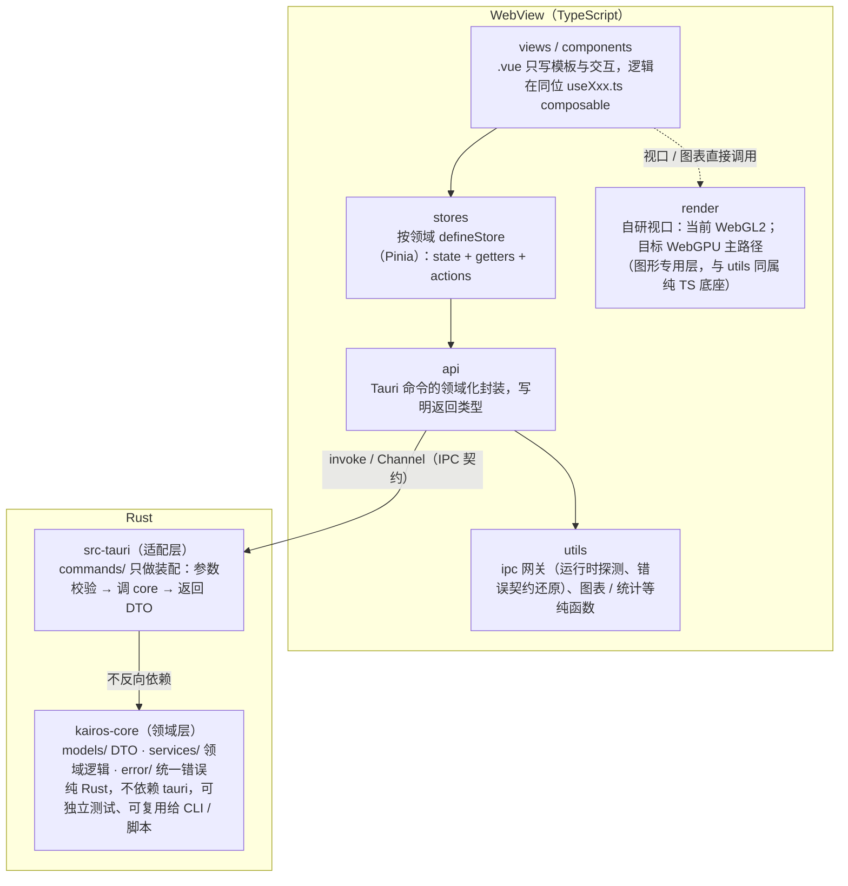
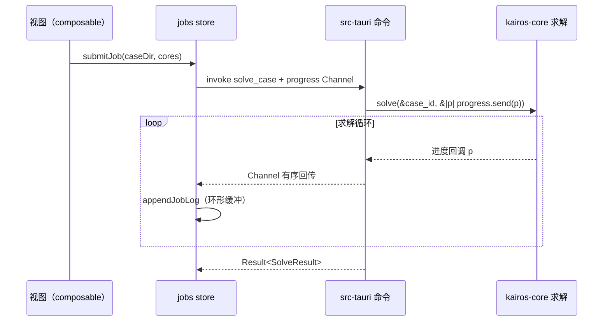

# Kairos 架构约定

> 模块完成度清单（分支勾选状态）见 [architecture-status.md](architecture-status.md)。

本文是 Kairos（注塑成型 CAE 仿真软件）的架构权威文档。所有新代码必须遵守这里的分层与契约；与 README 冲突时以本文为准。

## 1. 总览与依赖方向（铁律）



职责边界的判定标准（去掉 Vue 还能测就进 `.ts`、必须依赖 Vue API 才成立就进
composable、只描述 DOM 就留 `.vue`）与反模式清单见
[web-conventions.md](web-conventions.md)。

两条铁律：

1. **依赖只能向下**：`views / components → stores → api → utils`；Rust 侧 `src-tauri → kairos-core`。`kairos-core` 出现 `use tauri` 即为架构破坏（CI 的 clippy 不会拦，靠 review 把关）。
2. **业务逻辑只住 core**：`src-tauri` 的 commands 不写业务逻辑，只做「参数 → core 调用 → DTO 返回」的装配。这样所有领域代码都能脱离 Tauri 做单元测试，未来也能直接复用给批处理 CLI、Wasm 模块。
3. **计算住 core，前端以 UI 为主（Rust 优先原则）**：数值计算、几何与场处理、统计推断等逻辑代码，凡 Rust 更优（性能、与求解结果一致性、可复用 CLI）一律在 `kairos-core` 实现；TS 大部分场景性能不如 Rust（V8 单线程 + JIT 不确定性、无零成本抽象），前端只做 UI 编排与展示层逻辑。

### 1.1 逻辑归属判断（Rust 优先原则的落地）

新逻辑先问三个问题，任一为真 → 住 `kairos-core`（经 IPC 消费）：

1. 是**数值计算 / 几何 / 场处理 / 统计**吗？（网格质量、派生算子、适合度评分……）
2. **数据量大**吗？（万级元素以上的逐值运算）
3. 需要**与求解结果一致**或**复用给 CLI** 吗？

三条都否（UI 状态聚合、展示型格式化、轻量校验）→ 才落 TS 的
composable / utils。配套规则：

- **禁止双实现并存**：同一计算不允许 TS 重写一遍——core 是唯一事实源，
  TS 只消费其 DTO（例证：派生算子下沉 Rust、render_mesh 下沉、T56 纵横比
  按 core 统计设计；反例警示：TS 侧重算会带来性能与数值一致性双输）；
- **重计算不进前端**：数值流水线在 Rust 一次算完再返回，避免 TS 循环与
  大数组逐值往返；大数组跨 IPC 走二进制通道（`field_binary`，T51），不走
  JSON 数组；
- **TS 侧留什么**：与渲染状态强耦合、数据量小的聚合与格式化（如方案任务
  序列评估、图例 mid/max），它们脱离渲染就没有意义。

### 1.2 路径处理（唯一入口 `services::paths`）

路径一律走 `std::path`，**禁止手写分隔符、`split('/')`、字符串拼路径**——Windows 与
Unix 的分隔符、盘符、保留字符差异只在 `src-crates/kairos-core/src/services/paths.rs`
处理：

| 场景                | 用什么                                                                                  |
| ------------------- | --------------------------------------------------------------------------------------- |
| 拼装                | `paths::join(&[…])`（内部 `Path::join`）                                                |
| 取文件名 / 主干     | `paths::sanitize_file_name` / `paths::file_stem`（内部 `Path::file_name`、`file_stem`） |
| 补扩展名            | `Path::with_extension`（例：工程文件 `.kairos`、报告 `.html`）                          |
| 跨机器落盘          | `paths::to_storage`（分隔符归一为 `/`）/ `paths::from_storage`（读回并校验）            |
| 相对路径安全校验    | `paths::validate_relative`（拒绝绝对 / 根 / 盘符 / `..`）                               |
| 盘符语义（Windows） | `paths::wsl_path`（`C:` → `/mnt/c/a`）                                                  |

两条硬性理由：① `Path` 只认本平台分隔符（Unix 上 `C:` 是普通文件名，Windows 上
`a/b` 反而可解析），手写判定必然在某平台错；② 工程文件要跨机器搬，落盘形态必须固定
（`/`）且读取侧不需区分平台。前端同样不解析路径——按扩展名分派之类交给 Rust
（例：`import_geometry` 用 `Path::extension` 判定 STL/STEP/IGES）。

## 2. Rust 工作区

```
Cargo.toml               # 工作区根：成员、公共依赖版本、release profile（只能放这里）
src-crates/kairos-core/ # 领域层 crate（纯 Rust）
  src/models/            #   IPC DTO（serde 形状 = 前后端契约）
  src/services/          #   领域服务与计算逻辑（未来的网格/求解器/结果都在这）
  src/error.rs           #   KairosError 统一错误 + IPC 错误契约
  tests/contract.rs      #   契约测试：锁定序列化形状
src-tauri/               # Tauri 适配层 crate
  src/commands/          #   命令适配（每个领域一个模块）
  src/lib.rs             #   Builder 装配：插件、State、generate_handler（注册唯一入口）
  tauri.conf.json
```

拆成两个 crate 的收益：领域代码编译/测试不拖 Tauri 全家桶（后续引入 nalgebra、rayon 等重依赖时差距会非常明显）；`cargo test -p kairos-core` 秒级反馈；为 CLI / Python 绑定等复用留好了门。

## 3. IPC 契约

### DTO

- DTO 定义在 `kairos-core/src/models/`，`#[serde(rename_all = "camelCase")]`；
- 前端在 `src-web/types.ts` 镜像同构类型（一行 Rust 字段对一行 TS 字段）；
- **任何 DTO 改动必须同步两处，并让 `src-crates/kairos-core/tests/contract.rs` 与前端 vitest 双双通过**——契约测试失败即联调会爆错，宁可 here 失败不要上线失败。

### 错误契约

命令一律返回 `kairos_core::error::Result<T>`（即 `Result<T, KairosError>`）。Tauri 官方要求命令错误必须实现 `serde::Serialize`；本项目的稳定错误载荷是：

```json
{ "code": "validation", "message": "参数超出量程" }
```

`code` 取值固定为 `validation / not_found / io / solver / internal`（`ErrorKind`）。前端 `utils/ipc.ts` 把它还原为 `CommandError`（带 `.code` 字段）；UI 按 code 分支，**禁止对 message 做文本匹配**。

### 传输选型

| 场景                            | 机制                                                                    |
| ------------------------------- | ----------------------------------------------------------------------- |
| 请求/响应                       | `invoke` 命令（JSON）                                                   |
| 求解进度、日志流式回传          | `tauri::ipc::Channel`（类型安全、有序、高吞吐，官方推荐，优于事件系统） |
| 大体量二进制（网格/结果场数据） | `tauri::ipc::Response` 原始字节，避免 JSON 序列化开销                   |
| 后端主动广播（全局通知）        | `emit` 事件（仅限无法用 Channel 的场景）                                |

## 4. 命令层规范

### 线程模型（官方语义，写代码前先想清楚）

- **同步命令跑在主线程**——超过几毫秒的计算会卡死 UI；
- `#[tauri::command(async)]` / `async fn` 命令跑在 tokio 线程池；
- CPU 密集的长任务（求解器）在命令里用 `std::thread::spawn` + `Channel` 上报进度，或 `tauri::async_runtime::spawn_blocking`；
- **锁不跨耗时调用**：`State<Mutex<_>>` 的锁只圈住读写时刻，绝不持有锁跑求解。

### 长任务标准模式（进度回传）

```rust
use tauri::ipc::Channel;

#[tauri::command(async)]
fn solve_case(case_id: String, progress: Channel<SolveProgress>) -> Result<SolveResult> {
    // core: 在内部循环里调用回调；适配层把回调桥接到 Channel
    kairos_core::services::solver::solve(&case_id, &|p| {
        let _ = progress.send(p);
    })?;
    // ...
}
```

```ts
import { Channel, invoke } from "@tauri-apps/api/core";

const channel = new Channel<SolveProgress>();
channel.onmessage = (progress) => jobs.appendJobLog(jobId, `进度 ${progress}%`);
await invoke<SolveResult>("solve_case", { caseId, progress: channel });
```



### 新增一个命令的流程

1. core：`models/` 定义 DTO → `services/` 写领域函数（`Result<T, KairosError>`）→ 补单测；
2. 契约：`src-crates/kairos-core/tests/contract.rs` 补序列化断言；
3. 适配：`src-tauri/src/commands/<领域>.rs` 写薄命令；`lib.rs` 的 `generate_handler![]` 注册；
4. 前端：`types/index.ts` 镜像 DTO → `api/` 封装 → `stores/<域>` 加 action
   （失败经 `app.setError`，busy 用 `beginBusy/endBusy` 配对）→ composable 消费；
5. 前端测试：`tests/web/stores/<域>.test.ts` 用 `vi.mock` 覆盖成功/失败两条路径。

## 5. 状态管理

### Rust 侧

- 需要会话内共享的可变状态用 `tauri::Builder::manage(...)` 注册（如项目注册表：`State<'_, ProjectRegistry>`）；
- 容器选择：读多写少用 `RwLock`，写频繁用 `Mutex`；临界区必须极短（本项目用标准库锁，不引入 parking_lot）；
- 能重算的状态不入库：会话状态只存「不可再生的东西」，可从文件重载的数据以文件为准。

### 前端

- 按领域 defineStore（app / project / geometry / materials / jobs / pipeline / results /
  dependencies / vm）：action 是状态的唯一写入口，组件不自改领域状态；
- 响应式追踪由 Pinia 细粒度完成；跨域动作在 action 内引用其他 store；
  `menu-actions.ts` / `global-shortcuts.ts` 在处理器内懒取 store（模块加载早于 `createPinia()`）；
- IPC 不可用（浏览器预览）是预期场景：`IpcUnavailableError` 显示为中性提示并自动消失，与真实失败（红色）区分。

## 6. 测试策略

| 层               | 工具                           | 覆盖点                                 |
| ---------------- | ------------------------------ | -------------------------------------- |
| kairos-core 单测 | `cargo test -p kairos-core`    | 领域逻辑（数值算法对解析解、边界条件） |
| IPC 契约         | `tests/contract.rs` + `vitest` | serde 形状、错误契约、前端状态动作     |
| 适配层           | 保持薄，不专门测               | 逻辑都下沉到 core                      |
| 前端组件         | vitest + happy-dom             | 渲染分支、交互回调                     |

提交前门禁：`bun run verify`（typecheck → clippy(-D warnings) → format → test → knip，前后端全量）。

性能预算与基准：见 [perf-budget.md](perf-budget.md)（T01），所有涉及计算与渲染的任务以其为验收依据。

工程杂项：

- knip 配置里 `tailwindcss` 在 `ignoreDependencies` 中：它通过 `@tailwindcss/vite` 的 peer 依赖和 CSS `@import` 生效，knip 静态分析识别不到；
- `bun.lock` 与根 `Cargo.lock` 是提交入库的文本锁文件，勿加入 ignore；
- husky pre-commit 在每次 `git commit` 时自动执行 `bun run verify`，克隆后 `bun install` 经 `prepare` 脚本自动初始化钩子。

### 覆盖率门槛下的「假未覆盖」与应对（经验沉淀）

core 有 100% 行覆盖门槛，以下五种写法会让工具报出**不可达的未覆盖**——它们的共同点是
**隐藏的代码落点**。正确应对是改写代码，**不要用 `#[allow]` / `ignore` 掩盖**：那会连真正的
未覆盖一起盖住。

| 形态               | 例子                                                                    | 应对                                                             |
| ------------------ | ----------------------------------------------------------------------- | ---------------------------------------------------------------- |
| 断言里的内联闭包   | `assert!(rows.iter().any(\|r\| r.contains(..)))`                        | 抽成测试模块里的命名助手函数（`fn has(rows, needle)`），直接可测 |
| `map_err` 内联闭包 | 库报错时才执行的闭包（测试里不可达）                                    | 抽成命名函数并**直接测它**（断言错误 kind 与消息）               |
| `?` 算子的错误落点 | `bytes[a..b].try_into().ok()?`                                          | 先用显式长度检查，再按索引取字节（不引入 Result 转换）           |
| 单侧偏态分支       | `a ? "x" : ""` 的某一侧在真实输入下不会出现                             | 改写成逐步 `push` 的直白写法；**不要为偏态造奇怪用例**           |
| **跨平台语义差异** | 目录作为路径时：unix 打开成功、读取才失败（EISDIR）；Windows 打开即拒绝 | 同一语义的错误映射**只写一处**命名函数，两个平台都覆盖同一份代码 |

跨平台那条尤其隐蔽：本地 macOS 全绿、CI 上 Windows 才红。**错误映射不要按调用点分写。**

覆盖率结论**以 `bun run verify` 里的 `coverage:rust` 为准**：它自己解析 LLVM 工具
（rustup 工具链或系统 LLVM）。手动 `cargo llvm-cov` 可能因找不到 `llvm-profdata` 而
复用旧 profdata，报出假的 100%。

### 引入依赖的准入（许可 + 性能 + 包体）

**引用新依赖（含用库替换自写实现）必须同时给出三项对照**，任一项明显变差就不换：

1. **许可**：只接受 permissive（MIT / Apache-2.0 / BSD / ISC 等）。GPL/AGPL 只能子进程隔离
   （见 [decisions/openfoam-gpl-compliance.md](decisions/openfoam-gpl-compliance.md)）；
   GPU 一律走 wgpu，不引单厂商 SDK。
2. **性能**：换实现时把**旧实现留在基准里**同台对照（如 `benches/principal_axis.rs`），
   不拿「记忆里的数」比。实测例：`nalgebra` 版主方向比手写 Jacobi 快约 20%；`bytemuck`
   批量转换让网格编码从 2.22 ms 降到 163 µs。
3. **包体**：用**同口径**构建对比（`tauri build` 的包比 `cargo build` 的二进制大，混着比会
   得出假结论）。实测例：`csv` + `sha2` + `nalgebra` 合计 +0.44%；`@vueuse/core` 因
   tree-shaking 只 +1 kB。

自写的成本低于「引库 + 适配 + 升级」时就不引——判定依据见
[T95 依赖取向审查](tasks/T95-dependency-audit.md) 的决策表（逐条给了结论与理由）。

### 批次性改动的工作方式（踩坑总结）

- **收编 / 合并清单里的每一条，动手前先核实存在性**：清单来自盘点，盘点含推断。
  已有两次教训——「midplane 与 dualdomain 重复实现」实际早已共用（白写代码的风险）、
  「解压库化」核对后发现动机不成立（会为不存在的问题引入 C 依赖）。
- **不要用重复出现的片段当锚点**：同一文件里 `SolveAction::Submit` 出现两次，按它插入
  会把代码放进错误函数；机械替换跨文件更危险（`&` 在 Rust 里既是「该按值」也可能是
  「必须借用」）。做法：加足上下文，或按行号定位并**逐处断言原文再替换**，改完回读确认。
- **迁移类改动分批做**：每批只动一个面板 / 一个文件，随该处既有用例一起改、单独提交；
  一次全量改会让断言大面积翻车且难定位。

## 7. 后处理渲染决策

### 运行前提与后端边界

- 后处理是 **GPU 必需** 能力：受支持环境必须有可用的硬件加速 GPU。没有可用
  GPU 时，应用必须在进入后处理前显示明确的不支持原因；不提供 CPU 渲染或 CPU
  算子回退。CPU 实现只能用于单元测试、数值对拍和离线诊断。
- 前端渲染后端统一抽象为 `RenderBackend`。现有实现是 WebGL2；目标是自研
  WebGPU 主路径。WebGL2 仅可作为仍使用硬件 GPU 的兼容后端，不能被表述为
  CPU 降级或性能验收替代。
- Rust 的 `wgpu::Device` 与 WebView 中 JavaScript 的 WebGPU device 属于不同
  运行时和资源上下文，**不能共享同一个 device、buffer 或纹理**。两侧只通过
  明确的数据契约和二进制 IPC 交换数据；不得再写“渲染与 Rust 计算共享同一
  wgpu device”的目标。

### VTK.js 的位置

VTK.js 不是 Kairos 的领域数据模型或主架构依赖。它可以在独立 POC 中评估其
表面云图、裁剪、拾取和多视图能力；POC 不得将 `vtk*` 类型传入 `kairos-core`、
DTO、store 或项目文件。只有在 Tauri 三端实测满足性能、内存、包体和交互验收后，
才可作为可替换的前端 `RenderBackend` 实现引入。

当前主路径仍是自研渲染：它能直接表达 Kairos 的四面体单元、cell/point 场关联和
结果流式策略。VTK.js 的体渲染输入是规则 `ImageData`，不能直接替代非结构四面体
结果的体渲染；这类能力需要独立的重采样、误差控制和缓存设计。技术取舍与 POC
验收标准见 [T39](tasks/T39-postprocess-renderer-done.md)。

## 8. 参考文献

- Tauri 官方：Calling Rust from the Frontend（命令、线程模型、错误处理、State）— <https://v2.tauri.app/develop/calling-rust/>
- Tauri 官方：Calling the Frontend from Rust（Channel 流式回传）— <https://v2.tauri.app/develop/calling-frontend/>
- Tauri 官方：Inter-Process Communication 概念 — <https://v2.tauri.app/concept/inter-process-communication/>
- Tauri 官方讨论：多类错误的处理共识 — <https://github.com/orgs/tauri-apps/discussions/5008>
- Tauri 错误处理实践（thiserror + Serialize 模式）— <https://tbt.qkation.com/posts/tauri-error-handling/>
