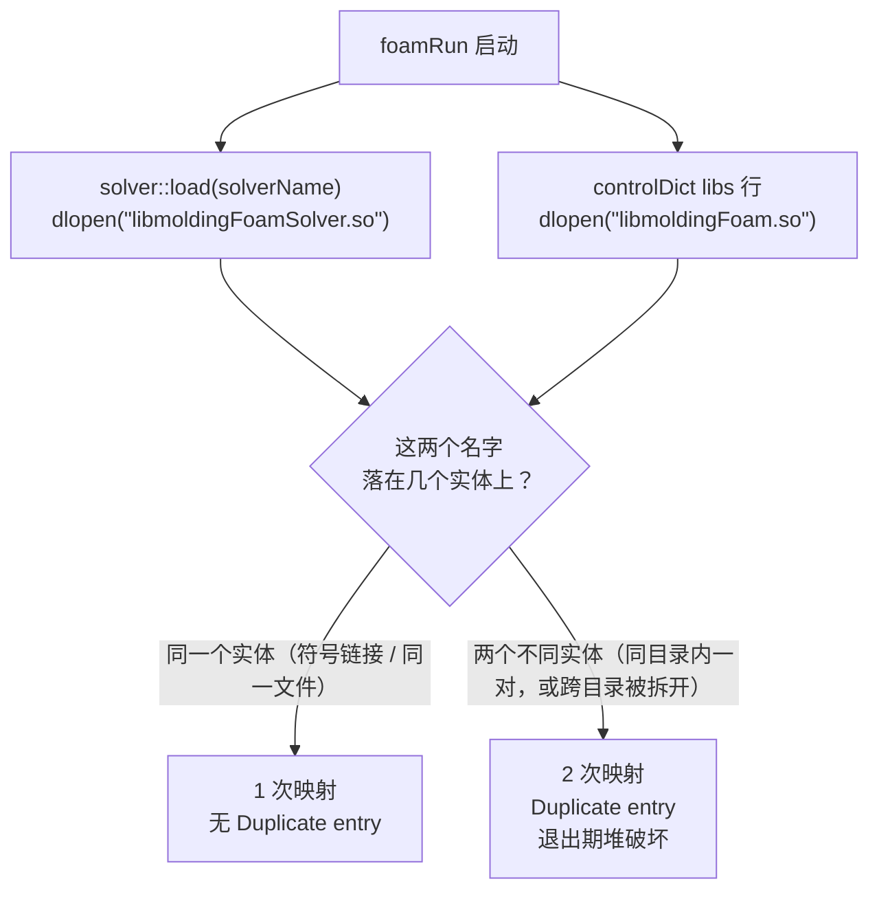

# 求解器库重复加载（037 退出崩溃）核对报告

用途：上游 2026-09-15 追问「037 的退出崩溃是否由求解器库被映射两次引起、你们日志里能看到
`Duplicate entry` 吗」的核对结果。结论是**成立**，但判据需要收窄——这次没停在「看日志」，
我们在自己的 VM 里做了受控 A/B/C 对照，把「什么时候会双载」钉到了具体条件上。

- 执行环境：macOS（Apple M4）→ Multipass VM `kairos`（Ubuntu 24.04 arm64，5 vCPU / 12 G）
- 求解环境：bundle **v1.0.0**（VM 内 `.kairos-release-tag` = `v1.0.0`），Open MPI **4.1.6**
- 相关任务：[T34](../tasks/T34-openfoam14-fork-entry-done.md) 遗留、[T29](../tasks/T29-real-solve-e2e.md)、
  [T97](../tasks/T97-solver-lib-duplication-guard.md)（本次新开）

## 0. 结论摘要

1. **上游的推断在我们这里成立**：出现退出崩溃的运行日志里都能看到 `Duplicate entry`，
   崩溃栈与上游给的完全同构（`UPstream::exit` ← `argList::~argList`）。我们不在「另一条问题线」上。
   同时这也独立印证了 2026-09-12 我们自己的定位（T34 遗留：同一求解模块被打包成两份独立 `.so`）。
2. **但「`$FOAM_LIBBIN` 与 `$FOAM_USER_LIBBIN` 各放一份就会双载」这个判据不成立**（实测反例见 §4-B）：
   两份完整拷贝时，`LD_LIBRARY_PATH` 里靠前的目录会把两个名字**都**遮住，仍然只有 1 次映射。
   真正会双载的是**两个 dlopen 名字落到两个不同实体上**——同目录内一对（历史形态），
   或名字在两个目录之间被拆开（§4-C 复现）。
3. **我们自己的运行环境是手工状态，存在审计缺口**：当前 VM 里生效的库是 `FOAM_USER_LIBBIN` 下
   一份**从源码重建**的库，而 bundle 自带的库被手工改名禁用了。所以此前那些 `dup=0` 的绿色运行
   **并未验证上游 v1.0.0 归档里的那份库**（§3、§6）。

## 1. 我方日志里的 `Duplicate entry` 证据

`grep -c 'Duplicate entry'` 逐份日志（VM 内 `/home/ubuntu`，`End` 列为 `^End$` 行数）：

| 日志                                                                             | Duplicate entry | unaligned fastbin | End | 时间        |
| -------------------------------------------------------------------------------- | --------------- | ----------------- | --- | ----------- |
| `study-1a09bc8e6c8-1/log.foamRun`                                                | **152**         | **4**             | 1   | 09-14 11:12 |
| `ff-min/log.foamRun`                                                             | **150**         | 0                 | 0   | 09-14 20:43 |
| `box6-run.log`                                                                   | 72              | 2                 | 3   | 09-12 18:12 |
| `box5-run.log`                                                                   | 72              | 3                 | 2   | 09-12 18:01 |
| `box2-run.log`                                                                   | 72              | 3                 | 2   | 09-12 17:36 |
| `box-run2.log`                                                                   | 71              | 0                 | 0   | 09-12 17:30 |
| `case/log.foamRun`                                                               | 18              | 0                 | 0   | 09-10 19:38 |
| 修复后全部运行（`kairos-runs/*`、`v3-*`、`t66`、`long6`、`study-1a0a07547b1-2`） | 0               | 0                 | —   | 09-13 起    |

去重后的注册项共 **28 条**（以 `case/log.foamRun` 为例），分组如下——上游点名的
`moldingFoam` / `molding*` `fvPatchField` / `fvModel` 都在里面：

- `solver` 表：`moldingFoam`、`moldingCoolantFluid`；
- `fvPatchField` 表 10 条：`moldingInletVelocity`、`moldingVentVelocity`、`moldingMoldTemperature`、
  `moldingRunnerTemperature`、`moldingChannelCooling`、`moldingConvectiveCooling`、`moldingVentPressure`、
  `moldingPrghPressure`、`moldingTractionDisplacement`、`moldingSlipVelocity`；
- `fvModel` 表：`moldingEigenstrain`、`moldingVoidClosure`、`viscoelasticStress`；
- 其余 13 条是被同一份模块代码二次实例化的：`CrossWlf`（`generalisedNewtonianViscosityModel`）
  与 `heRhoThermo<…>` 的 4 种模板实例 × `basicThermo` / `fluidThermo` / `rhoFluidThermo`。

> 更正：初次回复上游时我把 `fvPatchField` 的 `molding*` 数写成了 11，实际是 **10**（另有 2 条
> `solver`、2 条 `molding*` `fvModel`），去重总数 28。条数口径按本表为准。

## 2. 原始崩溃栈

`study-1a09bc8e6c8-1/log.foamRun` 行 59287 起（4 个 rank 各一组，此处取其一）：

```
End
Finalising parallel run
malloc_consolidate(): unaligned fastbin chunk detected
[13] [kairos:07335] *** Process received signal ***
[13] [kairos:07335] Signal: Aborted (6)
[13] [kairos:07335] [10] /lib/aarch64-linux-gnu/libc.so.6(__libc_free+0xd8)
[13] [kairos:07335] [12] .../lib/openmpi-system/libPstream.so(_ZN4Foam8UPstream4exitEi+0xb8)
[13] [kairos:07335] [13] .../libOpenFOAM.so(_ZN4Foam7argListD2Ev+0x1b4)
[13] [kairos:07335] [14] foamRun(+0x4948)
```

与上游描述的链路一致：`End` 之后析构 → `free` 触发 `malloc_consolidate` → `UPstream::exit`
住 `libPstream.so`、`argList::~argList` 住 `libOpenFOAM.so`（帧内路径为 bundle 的
`~/moldingfoam-env/...`），崩溃时机在正常打印 `End` **之后**。

## 3. 加载路径布局与归档内容

| 位置                                                                       | 内容（核对时状态）                                                                                                           |
| -------------------------------------------------------------------------- | ---------------------------------------------------------------------------------------------------------------------------- |
| `FOAM_LIBBIN`（bundle）                                                    | 只有 `libmoldingFoam.so.disabled-bundle`（**手工改名**；归档里的 `libmoldingFoamSolver.so` 符号链接被删）                    |
| `FOAM_USER_LIBBIN`                                                         | `libmoldingFoam.so`（实体，3,829,760 B，sha256 `7d4c7965…`）+ `libmoldingFoamSolver.so -> libmoldingFoam.so`（相对符号链接） |
| 上游归档 `/home/ubuntu/moldingfoam-bundle.tar.xz`（v1.0.0，113,871,868 B） | `libmoldingFoam.so`（实体，3,763,416 B）+ `libmoldingFoamSolver.so -> libmoldingFoam.so`（**符号链接，打包侧已修**）         |

两点需要说清楚：

- **归档本身是对的**：单一实体 + 相对符号链接，与上游 v0.2.1 起的修法一致；
- **当前生效的不是归档里那份**：`FOAM_USER_LIBBIN` 的库来自 `~/mf-src`（源码树，非 git 检出，
  09-14 23:19 拷入）的一次重建，与归档里的库 **sha256 不同**（`7d4c7965…` vs `76e5e5e3…`，
  体积也不同）。改名 `.disabled-bundle` 与删除符号链接都是手工动作——仓库里 grep 不到
  `disabled-bundle`，Kairos 也没有任何代码路径写 `FOAM_USER_LIBBIN`。

`LD_LIBRARY_PATH` 顺序（bundle 自带 `etc/bashrc`）：`FOAM_USER_LIBBIN` 在**第 5 位**、
`FOAM_LIBBIN` 在**第 7 位**，即用户目录优先。

## 4. 受控 A/B/C 对照（`mpirun -np 4`，运行期采样 `/proc/<pid>/maps`）

同一份 case（`study-1a0a07547b1-2` 的副本，endTime 3 s）跑三遍，只在两次运行之间改动
库目录布局；每次在运行期抓 4 个 rank 的 `/proc/<pid>/maps`：

| 实验             | 库目录布局                                                       | 每 rank `libmoldingFoam*` 映射 | 命中的实体                                   | Duplicate entry |
| ---------------- | ---------------------------------------------------------------- | ------------------------------ | -------------------------------------------- | --------------- |
| **A** 核对时现状 | LIBBIN 只有 `.disabled-bundle`；USER 为「实体 + 相对符号链接」   | **1**                          | USER `7d4c7965…`                             | 0               |
| **B** 两处各一份 | 把归档内容恢复到 LIBBIN（实体 + 符号链接）；USER 不变            | **1**                          | USER `7d4c7965…`（前列目录把两个名字都遮住） | 0               |
| **C** 名字被拆开 | USER 只留 `libmoldingFoamSolver.so`（**实体**），基名落到 LIBBIN | **2**                          | USER `7d4c7965…` + LIBBIN `76e5e5e3…`        | **152**         |

C 组实测的 `maps` 行（每个 rank 两条、两条 sha 不同）：

```
/home/ubuntu/OpenFOAM/ubuntu-14/platforms/linuxArm64GccDPInt32Opt/lib/libmoldingFoamSolver.so   7d4c7965b7393f7c…
/home/ubuntu/moldingfoam-env/openfoam14/platforms/linuxArm64GccDPInt32Opt/lib/libmoldingFoam.so  76e5e5e3cce5c271…
```

C 组的 `Duplicate entry` 计数 **152**，与 §1 里那份崩溃日志的 152 完全一致——
崩溃现场就这样被复现出来了（本次短跑在采样后即终止，未跑到 `End`，所以没再触发堆破坏）。



## 5. 机理（读 bundle 内源码）

- 求解模块按**裸 soname** 加载：`src/finiteVolume/solver/solverNew.C:32` →
  `libs.open("lib" + solverName + "Solver.so")`，由动态链接器按 `LD_LIBRARY_PATH` 搜索；
- controlDict 的 `libs ("libmoldingFoam.so")` 是第二个名字，同样按裸名搜索；
- 兜底路径 `dlLibraryTable::openPattern("lib.*Solver.so")`（`dlLibraryTable.C:170-192`）
  会把 `FOAM_LIBBIN` / `FOAM_SITE_LIBBIN` / `FOAM_USER_LIBBIN` 三个目录都列出来判断哪些名字要打开，
  但**仍然按裸名 dlopen**，所以遮挡关系不变；
- glibc 的 `dlopen` 按文件实体去重：**符号链接会让两个名字塌缩成一次映射**——这正是符号链接修复有效的原因，
  也解释了为什么 B 组干净而 C 组复现。

于是「会不会双载」的判据不是「有几份文件」，而是**每个 dlopen 名字在加载路径上是否只有唯一实体可达**。

## 6. 给上游的判据修正与我们的动作

**建议上游把不变式改写成这个口径**：对每个 dlopen 名字，加载路径上只能有一个实体可达；
`lib<名字>Solver.so` 必须是**同目录**下指向 `lib<名字>.so` 的符号链接。
「两个目录各放一份完整拷贝」在靠前目录遮住两个名字时并不会双载（§4-B），
所以按原措辞做检查脚本会误报；而真正危险的**半更新状态**（旧包残留导致某目录只剩一个名字）会被漏掉。

**我方动作**：

1. [T97](../tasks/T97-solver-lib-duplication-guard.md)（新开）：①求解环境就绪探测加「库重复」检查——
   按 `FOAM_LIBBIN` / `FOAM_SITE_LIBBIN` / `FOAM_USER_LIBBIN` 数实体，>1 或符号链接丢失即判不就绪并给出可执行的修复指引，
   让用户不必靠「跑完才崩」发现；②`env_deploy_command` 解压前先清环境树，避免新旧 bundle 文件叠加；
2. [T29](../tasks/T29-real-solve-e2e.md)：补一次**干净部署**（只留归档的库、清掉 `FOAM_USER_LIBBIN` 那份重建库）
   的 np4 复跑，`dup=0` + `End` 后退出码 0 才算真正验证了归档；
3. 流程约束：**不在 VM 的部署环境里手工重建求解库**。确需 A/B 时放到 scratch 目录 + 改 `LD_LIBRARY_PATH`，
   或在重建后立即恢复「符号链接 + 移除另一处实体」的不变式，并在收尾核对（见 §7 的核对命令）。

## 7. 复现步骤

```bash
# 1) 看日志里有没有双载（>0 即命中）
grep -c 'Duplicate entry' log.foamRun

# 2) 数实体：加载路径各目录里的 libmoldingFoam* 有几个实体、有没有符号链接
source <env_root>/openfoam14/etc/bashrc
for d in "$FOAM_LIBBIN" "$FOAM_SITE_LIBBIN" "$FOAM_USER_LIBBIN"; do
  find "$d" -maxdepth 1 -name 'libmoldingFoam*' -printf '%y %i %p -> %l\n'
done

# 3) 运行期看映射数（求解跑起来后对每个 rank 数一遍，>1 即双载）
grep -c libmoldingFoam /proc/<foamRun pid>/maps
```

本次核对的三份运行日志与 `maps` 采样未入库，暂存在宿主机 `/tmp/kairos-037-evidence/`
（`run-A.log` / `run-B.log` / `run-C.log` / `maps-C.txt`）；VM 内的临时 case、脚本与采样文件已清理，
部署环境按核对前状态还原（两个库的 sha256 与核对前一致）。
