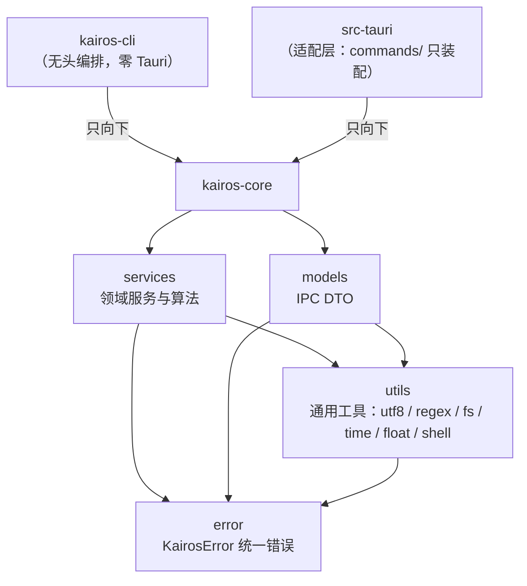

# Kairos Rust 规范

适用范围：`src-crates/`（`kairos-core`、`kairos-cli`）与 `src-tauri/` 全部 Rust 代码。

crate 之间的依赖方向、IPC 错误契约、线程模型由 [ARCHITECTURE.md](ARCHITECTURE.md) 定义；
本文回答的是**每一段 Rust 代码该放在哪一层**、层与层之间怎么解耦、以及通用工具的准入与写法。
改 Rust 代码前先读本文；code review 按此作为职责边界的裁决依据。

## 职责边界划分

| 内容                               | 放哪                      | Kairos 落点                                            |
| ---------------------------------- | ------------------------- | ------------------------------------------------------ |
| 数值 / 几何 / 场处理 / 统计算法    | `services/<域>.rs`        | `meshing`、`midplane`、`thickness`、`optimize`…        |
| 文件格式解析与生成                 | `services/<格式>.rs`      | `step`、`iges`、`moldingfoam`、`mesh_store`            |
| IPC DTO（serde 形状 = 前后端契约） | `models/<域>.rs`          | `models/project.rs`、`models/results.rs`               |
| 无领域语义的通用工具               | `utils/<主题>.rs`         | `utils/utf8`、`utils/regex`、`utils/fs`、`utils/time`… |
| 统一错误类型与 IPC 错误契约        | `error.rs`                | `KairosError` + `ErrorKind`                            |
| 路径拼装 / 解析 / 归一             | `services/paths.rs`       | 路径的唯一入口（见 ARCHITECTURE §1.2）                 |
| 领域规则的校验与判定               | `services/<域>.rs`        | 例：`solver` 的核数上限、依赖就绪判定                  |
| 命令适配（参数 → core → DTO）      | `src-tauri/src/commands/` | 每个领域一个模块，薄到「只有装配」                     |
| 进程 / 文件系统副作用              | `src-tauri/src/commands/` | 起进程、管道、PTY、Channel 桥接属适配层职责            |
| CLI 子命令与编排                   | `src-crates/kairos-cli/`  | 复用 core，零 Tauri 依赖                               |
| 应用装配、插件注册、原生菜单       | `src-tauri/src/lib.rs`    | `Builder` 链 + `generate_handler![]`（注册唯一入口）   |

> **先于上表判断**：**逻辑住 core，适配层只装配**。`src-tauri` 与 `kairos-cli`
> 都可以依赖 `kairos-core`，反之绝对不行；core 里出现 `use tauri` 即架构破坏。
> 判断口诀与收益见 [ARCHITECTURE.md §1](ARCHITECTURE.md)。

## 判断标准

一段代码该落在哪一层，按顺序问，命中即停：

1. **能被别的域无关地复用吗**（不涉及本项目的几何 / 场 / 工程等概念）？
   命中 → `utils/`。判定标尺：函数名与注释里出现「网格 / 场 / 工况 / 方案」等本领域
   词汇，就**不是** utils，回 `services/`。
2. **是数值 / 几何 / 场处理 / 统计**，或**数据量大**，或需要**与求解结果一致 / 复用给
   CLI** 吗？命中 → `services/`（Rust 优先原则，见 [ARCHITECTURE.md §1.1](ARCHITECTURE.md)）。
3. **只做「IPC 参数 → core 调用 → DTO 返回」的搬运**吗？命中 → `src-tauri/src/commands/`。
   命令里出现 `for` 循环算东西、`match` 判领域规则、`format!` 拼领域文案，都是越权信号。
4. **描述持久化形状**吗？命中 → `models/`，且必须与 TS 侧镜像同步（契约测试锁定）。

反例（都是真实踩过的形态）：适配层推导归一化的 scale/offset 与阈值（属 2）；适配层拼
bash 脚本字符串（属 `services/vm`）；适配层递归遍历目录树（属 `utils/fs`）；
DTO 上挂「方案名去重」这类领域规则（属 `services/`）。

## 依赖方向



依赖只能向下，且 core 内部的层次是**单向**的：

| 层         | 可依赖                     | 不可依赖                                      |
| ---------- | -------------------------- | --------------------------------------------- |
| `error`    | 无（最底层）               | 任何 core 内模块                              |
| `utils`    | `error`                    | `models` / `services`（工具不得认识领域类型） |
| `models`   | `error`、`utils`           | `services`（DTO 不含逻辑）                    |
| `services` | `error`、`utils`、`models` | `src-tauri`、`kairos-cli`（向上依赖即破坏）   |

两条硬性理由：`utils` 反向依赖 `services` 会让工具变成「某领域的私有助手」，复用价值归零；
`models` 依赖 `services` 会让 DTO 与逻辑互相缠绕，契约测试无法独立锁定序列化形状。

## 模块组织

### 目录结构

```
src-crates/kairos-core/src/
  lib.rs              # 只声明 mod，不写逻辑（模块树即 crate 地图）
  error.rs            # KairosError + ErrorKind + IPC 错误契约
  utils/              # 通用工具：无领域语义、可被任意层复用
    mod.rs            #   只声明子模块
    utf8.rs           #   安全截断 / char 边界 / 字符↔字节下标 / 补宽
    regex.rs          #   集中编译与缓存 + 预定义模式
    fs.rs             #   原子写入 / 有界深度遍历 / 带动作描述的读取
    time.rs           #   时间戳
    float.rs          #   浮点排序 / 极值 / 包围盒累积
    shell.rs          #   shell 引号转义
  models/<域>.rs      # IPC DTO，一行 Rust 字段对一行 TS 字段
  services/<域>.rs    # 领域服务与算法，模块名即领域名
src-crates/kairos-cli/src/main.rs   # clap 子命令 + 编排
src-tauri/src/
  lib.rs              # Builder 装配 + generate_handler![]（注册唯一入口）
  commands/<域>.rs    # 薄适配
```

### `mod` 拆分

- **拆分信号**：一个文件同时承担两件可命名的事（如「解析」+「持久化」+「算法」）；或
  单文件超过约 600 行且内部出现天然分节注释。按**职责**拆，不按行数机械拆。
- **不要提前拆分**：小于约 150 行且只有一件事的模块保持单文件，拆成目录反而增加跳转成本。
- **目录化**：拆分后仍属同一领域时用目录 + `mod.rs`（如 `services/results/{scan,parse,cache}.rs`），
  上层调用路径保持不变。
- `lib.rs` / `mod.rs` **只做声明**：不写函数、不放常量、不做 re-export 之外的逻辑。
  需要对外保持旧路径时，在旧模块里写 `pub use` 转发，不为兼容而在声明文件里堆代码。

### 可见性

| 场景                                             | 用什么              |
| ------------------------------------------------ | ------------------- |
| 跨 crate 使用（core → 适配层 / CLI）             | `pub`               |
| 同 crate 跨模块使用                              | `pub(crate)`        |
| 仅父子模块共享（如模块与它的测试、内部分解步骤） | 私有 / `pub(super)` |

**注意**：`kairos-core` 是 lib crate，未被调用的 `pub` 项**不触发** `dead_code` 警告，
而未被调用的 `pub(crate)` 项**会**触发并让 `clippy -D warnings` 失败。因此
`utils` 的接口一律 `pub`——它们是 core 对外承诺的一部分，供 CLI 与适配层直接复用。

## utils 层约定

### 准入条件

进 `utils` 必须**同时**满足三条，缺一条就回 `services/`：

1. **无领域语义**：函数签名与文档里不出现网格 / 场 / 工况 / 方案 / 项目等本项目词汇；
2. **被两个以上调用点需要**，或属于已定型的基础设施（文件、时间、编码）——后者即使暂无
   第二处调用也应收口，避免同类逻辑各写一份；
3. **无副作用或副作用显式**：纯函数优先；涉及 IO 的（`fs`）必须返回 `Result` 并把
   失败路径写进签名。

**反模式：`utils` 黑洞**。把「不知道该放哪」的东西一律塞进 `utils`，会让它退化成
事实上的 `services`，同时破坏上面第 1 条。判定标尺同准入条件 1：出现领域词汇即出局。

### `utils/utf8`

`&str` 的**字节下标**与**字符概念**混用是 Rust 里最容易 panic 的一类 bug
（`&s[..n]` 落在多字节字符中间直接 panic）。本项目禁止手写 `is_char_boundary` 循环、
禁止裸 `&s[..n]` 切片，一律经本模块：

| 需求                        | 函数                                                     |
| --------------------------- | -------------------------------------------------------- |
| 求 ≤ 给定字节数的 char 边界 | `floor_char_boundary(s, max_bytes) -> usize`             |
| 求 ≥ 给定字节数的 char 边界 | `ceil_char_boundary(s, min_bytes) -> usize`              |
| 按字节预算截断（不 panic）  | `truncate_bytes(s, max_bytes) -> &str`                   |
| 按字节预算截断 + 省略号     | `truncate_bytes_with_ellipsis(s, max_bytes) -> Cow<str>` |
| 按字符数截断                | `truncate_chars(s, max_chars) -> &str`                   |
| 字节下标 → 字符下标         | `byte_to_char_index(s, byte_index) -> usize`             |
| 字符下标 → 字节下标         | `char_to_byte_index(s, char_index) -> usize`             |
| 按字符数右侧补齐            | `pad_end_chars(s, width, pad) -> String`                 |

约定要点：

- 截断类函数**永不 panic**：预算超过长度时原样返回，预算落在字符中间时向前退到边界。
  返回 `&str` 而非 `String`，调用方需要所有权时自己 `.to_string()`。
- 标准库的 `floor_char_boundary` / `ceil_char_boundary` 仍是 unstable，故自行实现，
  实现里用 `is_char_boundary` 逐个退让，**不要**用 `char_indices` 收集后再查找（O(n) 分配）。
- 按**显示宽度**对齐（中英文混排的美化）不属本模块——那需要东亚字符宽度表，
  引依赖的准入另议；本模块只保证**字符数**与**字节安全**。
- 十六进制 / base64 / CSV 转义各归其位（`services/digest`、`services/report_pptx`），
  不进 `utf8`。

### `utils/regex`

**正则一律经本模块编译，禁止在函数体内直接 `Regex::new`**——`Regex::new` 每次调用都会
重新编译（典型模式几十微秒），放在循环或每帧路径里是明确的性能缺陷；同时分散编译让
「同一模式写两份、字面量已漂移」难以发现。

| 需求                | 用法                                                     |
| ------------------- | -------------------------------------------------------- |
| 低频 / 模式来自变量 | `compiled(pattern) -> Result<Arc<Regex>>`（带全局缓存）  |
| 高频固定模式        | `patterns::<名字>`（`LazyLock<Regex>` 静态量，编译一次） |
| 只判是否命中        | `is_match(pattern, text) -> Result<bool>`                |

约定要点：

- **缓存实现**：`static CACHE: LazyLock<Mutex<HashMap<String, Arc<Regex>>>>`，
  `LazyLock` 保证首次访问才初始化，`Mutex` 只圈住查表与插入（临界区极短，符合
  ARCHITECTURE §5）。返回 `Arc<Regex>` 而非 `&'static Regex`——后者要么 `Box::leak`
  无限泄漏，要么把缓存变成自引用结构，都不划算。
- **编译失败走 `KairosError::validation`**：模式字符串是调用方给的输入，不是内部不变量。
- **预定义模式放 `utils/regex::patterns`**：命名 `SCREAMING_SNAKE_CASE`，每个模式配一条
  正例 + 一条反例测试（含「不应命中」的边界样例）。新增模式必须同时加测试。
- **不要在热路径上做字符串→正则的映射**：需要"按名字取模式"时把名字映射写成 `match`
  返回 `&'static LazyLock<Regex>`，别每帧查 `HashMap`。
- **能不用正则就不用**：单字符切分（`split_once`）、前后缀剥离（`strip_prefix`、
  `strip_suffix`）、定宽列切片都比正则快且更易读。正则留给「多分支 / 重复组 / 需要
  捕获」的场合，别为了一行写法把简单解析改成正则。

依赖说明：`regex` 已作为 `kairos-core` 的**传递依赖**存在（`ppt-rs → pdfrs → regex v1.13.1`），
提升为直接依赖不新增 crate、不改变已编译产物，满足引入依赖的许可 / 性能 / 包体三项对照
（见 [ARCHITECTURE.md §6](ARCHITECTURE.md)）。

### `utils/fs`

| 需求                          | 函数                                                                                           |
| ----------------------------- | ---------------------------------------------------------------------------------------------- |
| 原子写入（临时文件 + rename） | `write_atomic(path, content, what) -> Result<()>`                                              |
| 有界深度遍历目录              | `walk_dirs_bounded(root, max_depth, visit: &mut dyn FnMut(&Path) -> bool)`（返回是否继续下探） |
| 有界深度找文件                | `find_file_bounded(root, max_depth, predicate) -> Option<PathBuf>`                             |
| 读文本 + 归一 IO 错误         | `read_to_string(path, what) -> Result<String>`                                                 |

约定要点：

- **原子写入必须同目录**：临时文件放目标同目录，跨目录 rename 不是原子操作；rename 失败要
  清理临时文件，否则失败一次留一个 `.tmp`。临时文件在文件名后**追加** `.tmp`（`a.stl` →
  `a.stl.tmp`）而不是用 `with_extension` 替换扩展名——后者会让同目录下的 `a.stl` 与 `a.step`
  争用同一个 `a.tmp`。
- **遍历接口取 `&mut dyn FnMut`，不取泛型**：泛型会按每个调用方的闭包类型各单态化一份，
  同一源码行登记多次，其中未被走到的实例会被报成未覆盖。这正是
  [ARCHITECTURE.md §6](ARCHITECTURE.md) 「多份单态实例」那条的应对方式。
- **遍历的「命中即停」靠回调返回值**：`visit` 返回 `false` 表示把该目录当叶子不再下探
  （如「找到环境根目录就不再往里找」），不要为此另写一份递归。
- 遍历**只读不删**：需要删除 / 覆盖的调用方自己做，工具不隐藏破坏性操作。
- `read_to_string` 的 `what` 是**动作描述**（如「读取场文件」），用于拼出可读的中文错误
  （`读取场文件失败：…`），避免每个调用点手写同一句 `map_err`。

### `utils/time`

`now_ms() -> u64`：Unix 毫秒时间戳，系统时钟早于 epoch 时返回 0（不 panic）。

**时间戳只在适配层与 core 的编排函数里取**，不要散落在算法内部——算法接收时间参数才可测试
（`services/jobs` 的 `now_ms: u64` 形参就是这个形态，保持它）。

### `utils/float`

| 需求                       | 函数                                                               |
| -------------------------- | ------------------------------------------------------------------ |
| 浮点升降序排序（NaN 安全） | `sort_asc(&mut [f64])` / `sort_desc(&mut [f64])`                   |
| 极值                       | `min_max(&[f64]) -> Option<(f64, f64)>`                            |
| 包围盒累积                 | `Aabb::empty()` / `extend_point` / `extend_points` / `min` / `max` |
| 安全比例                   | `safe_ratio(numerator, denominator, epsilon) -> f64`               |

约定要点：

- **禁止 `partial_cmp(..).unwrap()`**（NaN 下 panic），也**不要**用
  `partial_cmp(..).unwrap_or(Ordering::Equal)` 这种把 NaN 当相等的兜底——它让排序结果
  依赖输入顺序。统一用 `f64::total_cmp`：全序、无 panic、结果确定。
- **`Aabb` 用 `extend_point` 累积而非接收迭代器**：泛型迭代器会带来上面 `fs` 那条同样的
  多份单态化问题，且调用方本来就在循环里；`extend_point` 非泛型，零分配且只实例化一份。
- **`Aabb` 用 `f64::INFINITY` / `f64::NEG_INFINITY` 作初值**，不要用
  `f64::MAX` / `f64::MIN`——后者在空输入下依赖溢出才走到「空」分支，可读性差。
- **epsilon 常量不在此收口**：现有 `1e-9` / `1e-12` 各有其量纲与来历，机械统一会改变数值
  行为。`safe_ratio` 的 `epsilon` 由调用方显式传入，保持每个调用点的物理含义可见。

### `utils/shell`

| 需求                              | 函数                                 |
| --------------------------------- | ------------------------------------ |
| 单引号内转义（`'` → `'\''`）      | `bash_single_quote(value) -> String` |
| 单引号包裹（`value` → `'value'`） | `bash_quote(value) -> String`        |

约定要点：

- 只做**引号内**转义，不负责加引号——两者分开，避免调用方以为拿到的是「已安全」的片段却
  漏了外层引号。需要完整安全参数用 `bash_quote`。
- 拼 shell 命令的**领域逻辑**仍住 `services/vm`（哪些命令、什么顺序、传给谁），
  本模块只提供转义原语。

## 错误处理

- **唯一错误类型是 `KairosError`**（`error.rs`），公开函数一律返回
  `kairos_core::error::Result<T>`。跨 IPC 序列化为 `{ code, message }`，
  `code ∈ validation / not_found / io / solver / internal`；前端按 `code` 分支，
  **禁止文本匹配 message**。
- **不要引入 `thiserror` / `anyhow`**：错误类型只有一种、变体只有五个，手写
  `Display` + `From` 的成本低于引入依赖；`anyhow` 会抹掉 `code`，直接破坏 IPC 契约。
  将来真需要按域细分时，判据是「必须新增 `code` 变体并由前端分支」——那一步要同步
  改契约测试与 TS 类型，属架构变更而非工具引入。
- **禁止 `Result<_, String>`**：字符串化错误丢掉了 `code`，前端无法分支。领域规则返回
  `KairosError::validation`，并把规则放在 `services/`，不要挂在 `models/` 的 DTO 上。
- **命令必须返回 `Result`**：即使当前实现不可能失败，也要包 `Result<T>`——否则将来
  加校验就是破坏性 API 变更。
- **`serde_json` 错误统一经 `From` 转换**为 `KairosError::internal`，不要在序列化点写
  `to_string_pretty(..).expect("…序列化失败")`：那是把内部不变量失败变成进程终止，
  而序列化失败在磁盘满 / 结构超深时是可能发生的。

### `unwrap` / `expect` 的边界

生产代码（非 `#[cfg(test)]`）里 `unwrap()` **一律禁止**。`expect()` 仅限以下三种，
且 `expect` 的消息必须写明**被依赖的不变量**：

1. **常量参数**：`FieldCache::new(8).expect("默认容量在合法区间")`；
2. **已显式前置校验**：紧邻的长度 / 越界检查之后的 `try_into()`，消息写「长度已检查」；
3. **顶层入口**：`tauri::Builder::build(..).expect("error while running tauri application")`
   这类「失败即无法启动」的位置。

测试代码不受此限，但**测试里的 `expect` 消息要能指明是哪个断言挂了**（写「GPU 归一化」而不是
`unwrap()`），失败时才不用回读源码。

## 命名与风格

- **类型 / trait**：`PascalCase`，名词短语（`KairosError`、`HostRunner`、`Aabb`）。
- **函数 / 方法 / 变量**：`snake_case`，动词短语（`write_atomic`、`floor_char_boundary`）。
- **常量 / 静态量**：`SCREAMING_SNAKE_CASE`（`DEFAULT_VALUE_BUDGET`、`PNG_SIGNATURE`）。
- **模块 / 文件**：`snake_case`，用**单数**领域名（`services/mesh_store.rs` 而非 `meshes.rs`）；
  同领域多文件时用目录 + 语义化子模块名（`results/scan.rs`），不要 `results/helper.rs`。
- **布尔量**：`is_` / `has_` / `should_` 前缀（`is_magnitude`、`should_stop_when_idle`）。
- **返回 `Option` 与非 `Option` 的同义函数**：`var_opt` / `try_var` 不是本项目风格，
  改用语义名区分（`unit_or_none`、`wsl_path`）或直接让返回值类型说话。
- **单位写进名字**：`now_ms`、`time_s`、`size_bytes`、`deadline_s`——避免 `timeout: u64`
  这种要靠注释才知道单位的签名。
- **中文注释、英文标识符**：见下节。

### 坏味道清单

| 坏味道                              | 后果与纠正                                                                        |
| ----------------------------------- | --------------------------------------------------------------------------------- |
| God module（一个 <域>.rs 管多件事） | 改一处要读千行；按职责拆目录（`services/results/{scan,parse,cache}.rs`）          |
| `utils` 黑洞                        | 工具层退化成事实上的 `services`；按准入条件 1 判定，出现领域词汇就出局            |
| 双实现并存                          | CPU 与 GPU、core 与适配层各写一份算法，久了必然漂移；core 是唯一事实源            |
| 字符串承载领域语义                  | `Result<_, String>`、裸 `Vec<String>` 返回值；改用 `KairosError` 与结构化类型     |
| DTO 上挂领域规则                    | `models/` 里做去重 / 校验 / 命名规则，让契约形状不再稳定；规则搬 `services/`      |
| 适配层算东西                        | 命令里出现数值推导、领域 `match`、脚本拼装；搬 `services/`，命令只留装配          |
| 命令模块互相调用内部                | `commands/a.rs` 依赖 `commands/b.rs` 的 `pub(crate)` 实现；下移到 core 或提为服务 |
| 进程级 `static` 可变状态            | 无法隔离测试、与 `manage` 注册的状态两套心智模型；改用 `Builder::manage`          |
| 注释与实现漂移                      | 文档自称「回退路径」而决策已禁止回退；改实现必须同步改注释（comment-style.md）    |
| 注释引用规划信息                    | `Txx` / 对标出处 / 真机叙事进代码注释；由 `bun run lint:comments` 拦截            |
| 未落地的「预留」抽象                | 零调用者的参考实现靠单测维持 100% 覆盖；要么接上真实调用点，要么删                |

## 测试

| 层              | 位置                                 | 覆盖点                                  |
| --------------- | ------------------------------------ | --------------------------------------- |
| core 单元测试   | 同文件 `#[cfg(test)] mod tests`      | 领域逻辑、边界条件、数值对拍解析解      |
| core 跨模块集成 | 同 crate `#[cfg(test)]` 下的独立模块 | 需要多个 service 协作的路径             |
| IPC 契约        | `tests/rust/contract/main.rs`        | serde 形状、错误契约（前后端共同锁定）  |
| 全流程端到端    | `tests/rust/e2e/main.rs`             | 正常路径、失败与取消路径                |
| 适配层          | `src-tauri/src/commands/*.rs` 内     | 装配正确性；装配以外的逻辑应先下沉 core |

约定要点：

- **单元测试与实现同文件**，紧邻被测代码；只有需要多个 service 协作或需要真实进程 /
  文件系统时才另起模块。测试地图见 [tests/README.md](../tests/README.md)。
- **覆盖率门槛**：`kairos-core` 行覆盖 100%（`bun run coverage:rust`），前端逻辑层另计。
  「假未覆盖」的六种形态与正确写法见
  [ARCHITECTURE.md §6](ARCHITECTURE.md)——**禁止用 `#[allow]` / `ignore` 掩盖**。
- **设计接口时就考虑覆盖率**：泛型回调（`walk_dirs_bounded`）、内联闭包（`map_err`）、
  偏态分支都会制造隐藏落点。取 `&mut dyn FnMut` 而非泛型、把错误映射抽成命名函数，
  既是可测性也是纯粹性。
- **数值测试用容差**：浮点比较写 `(a - b).abs() <= 1e-9` 或相对误差，不要 `assert_eq!`
  两个浮点计算结果；对拍 GPU 与 CPU 时容差写进断言旁边。
- **测试名说清「期望行为」**，不写 `test_1`：`normalize_maps_min_max_to_zero_one`、
  `derive_difference_rejects_length_mismatch`。

## 文档与注释

- **模块头用 `//!`**：一句话说清本模块职责与在分层中的位置；涉及跨平台或非直觉决策时补
  一句 Why。`lib.rs` 的模块头是 crate 的地图，改动分层时同步更新。
- **公开项用 `///`**：一句中文说明职责与约束（前置条件、单位、panic 条件、错误 `code` 语义）。
  不强制 `@param` / `@return`。
- **私有函数用 `//`**：只在需要解释 Why 时写。
- **只写 Why，不复述 What**；注释过期比没有注释更糟——改实现必须同步改注释。
- **禁止在代码注释里出现规划信息**（`Txx`、对标出处、真机叙事、日期戳、评审文档路径）：
  规划属 `ai-docs/`，由 `bun run lint:comments` 拦截。规范细则见
  [comment-style.md](comment-style.md)。
- **注释不得与已定型的架构决策冲突**：例：CPU 实现只能定位为「正确性基准与测试参考」，
  不得写成「GPU 不可用时的回退」（[ARCHITECTURE.md §7](ARCHITECTURE.md) 明确不提供运行时回退）。

## 大型 / 多人协作演进方向

当前规模下 `services/<域>.rs` 即逻辑层，一个模块一个领域。若单模块继续膨胀或多人并行改动
同一文件，按以下顺序演进：

1. **先拆文件**：把 `services/results.rs` 这类多职责大文件拆成目录（`scan` / `parse` /
   `cache` / `binary`），纯搬运、不改签名；
2. **再抽 utils**：拆分过程中暴露出的域无关片段（字符串、文件、浮点）上提到 `utils/`，
   同一次提交里让所有调用点改走新入口；
3. **仍不够再考虑 crate**：只有当「core 编译时间」或「依赖闭包」成为真实痛点时才切分
   crate（例如把 `utils` 独立出去给不依赖 serde 的场景复用）——多一个 crate 会带来版本
   同步与公共依赖提升成本，收益不明确就不做。

**适配层的收缩是持续方向**：`src-tauri/src/commands/` 只应保留「参数校验 → core 调用 →
DTO 返回」与进程 / 文件系统副作用。发现命令里出现算法、领域规则或脚本拼装，就是把逻辑
下沉到 `services/` 的信号。

## 与既有文档的关系

- crate 间依赖、IPC / 错误契约、线程模型、覆盖率写法：[ARCHITECTURE.md](ARCHITECTURE.md)
- 前端分层与 composable 约定：[web-conventions.md](web-conventions.md)
- 注释风格（中文、Why-only、禁规划引用）：[comment-style.md](comment-style.md)
- 测试分类与跑法：[tests/README.md](../tests/README.md)
- 性能预算与基准：[perf-budget.md](perf-budget.md)
- 已定型的架构决策（GPL 隔离、运行时分发、渲染后端）：[decisions/README.md](decisions/README.md)
