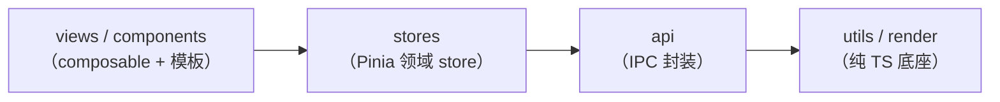

# Kairos Web 前端规范

适用范围：`src-web/` 全部代码。分层契约（`views / components → stores → api → utils / render`）
由 [AGENTS.md](../AGENTS.md) 定义，本文回答的是**每一段代码该放在哪一层**，以及层与层之间怎么解耦。
改前端代码前先读本文；code review 按此作为职责边界的裁决依据。

## 职责边界划分

| 内容                 | 放哪                    | Kairos 落点                                                            |
| -------------------- | ----------------------- | ---------------------------------------------------------------------- |
| 模板、样式、动画     | `.vue`                  | `views/<module>/Xxx.vue`、`components/**/Xxx.vue`                      |
| 事件绑定、v-model    | `.vue`                  | 同上（绑定的处理函数来自 composable 返回值）                           |
| 响应式状态、计算属性 | `useXxx.ts`             | `views/<module>/useXxxPanel.ts`、`components/<comp>/useXxx.ts`         |
| 接口请求、参数组装   | `api/*.ts`              | Tauri invoke 封装，薄适配层，不含业务判断                              |
| 数据转换、格式化     | `utils` / store action  | `utils/`（chart/stats/report 等纯函数）、展示型格式化就近放 composable |
| 跨组件共享状态       | `stores`                | 按领域一个 defineStore，禁止新建「公共 store」收容杂物                 |
| 纯业务算法、校验     | 领域 `.ts`，无 Vue 依赖 | `utils/`（如 pipeline 前置校验）、`render/`（图形算法）                |
| 类型定义             | `types/`                | `types/index.ts` 统一出口，前后端契约以 contract 测试锁定              |

图标组件统一放 `components/ui/icons/`，设计语言、双轨分类（Mono 按钮
图标 / Art 彩色图示）与强制参数见 [icon-design.md](icon-design.md)；
**不引入第三方图标素材**（项目不使用第三方专有代码或数据，自绘可同时
免除署名与再分发合规负担）。

## 判断标准

- 这段代码**去掉 Vue 还能独立测试和运行** → 放 `.ts`（utils / api / render）；
- **必须依赖 `ref`、`onMounted` 这类 Vue API** 才能工作 → 放 composable（useXxx.ts）；
- **只描述 DOM 结构和样式** → 留 `.vue`。

三个问题依次问，命中即停。`.vue` 里写 `if (值 > 100)` 这类判断逻辑、composable 里写
`querySelector` 这类 DOM 查询，都是边界失守的信号。

## 依赖方向

依赖只能向下，禁止反向与跨层（如 composable 绕过 store 直接 import api）。

## 通信与解耦约定

1. **composable 返回「绑定 + 方法」**，`.vue` 直接解构使用：模板需要的每个名字都在返回对象里，
   `.vue` 的 script setup 只剩导入与解构。
2. **props / emit 只传数据和事件**，不向子组件传操作函数（插槽场景除外）。子组件要触发业务动作，
   emit 事件由父层处理，或子组件自行使用 store。
3. **领域逻辑不 import Vue**。`utils/`、`render/`、`api/` 保持纯 TS——这正是它们能脱离组件
   单测的原因（覆盖率 100% 门槛也只卡在 utils 上）。
4. **错误处理分层各司其职**：`api/` 把失败归一为带 `code/message` 的错误对象抛出（含 IPC 不可用
   的环境提示）；store action 统一接住并转入 `app.setError` / `beginBusy`，busy 前后置用
   `beginBusy/endBusy` 配对；composable 与 `.vue` **不自行 try/catch**，只消费成功后的状态。
5. **类型集中管理**：`types/index.ts` 是唯一出口，`.vue` 与纯 TS 共同引用；跨层传递的领域结构
   （Project / MeshingReport 等）不得在组件里重新声明形状。
6. **命令式图形是例外而非反模式**：canvas 2D / WebGL 的绘制由 composable 调用 `render/` 与
   `utils/chart` 的绘制函数完成——DOM 负责挂载体（`<canvas>` 元素），像素操作归图形层。

## 常见反模式

| 反模式                                   | 后果与纠正                                                                    |
| ---------------------------------------- | ----------------------------------------------------------------------------- |
| `.vue` 里堆几百行 script，业务和 UI 混写 | 抽 useXxx.ts；`.vue` 的 script 超过「导入 + 解构 + 一行说明」即算超标         |
| composable 直接操作 DOM                  | 结构归 `.vue`；图形绘制走 `render/` / `utils/chart`，不摸 querySelector/style |
| 领域 `.ts` 里 import `ref` 等 Vue API    | 污染纯逻辑层，破坏无 Vue 单测；发现即下沉回 composable                        |
| 什么都往同一个 store 塞                  | store 变成上帝对象；严格按领域拆（app/project/geometry/…），新领域建新文件    |
| props 传函数回调                         | 破坏单向数据流；改为 emit 事件，或让子组件直接使用 store                      |
| 组件里重复声明后端返回的数据形状         | 以 `types/` 为准，形状漂移由 contract 测试拦截                                |

## 大型 / 多人协作演进方向

当前规模下 composable 即逻辑层。若后续面板数量与交互复杂度明显增长，在 composable 之下再分
**service / domain 层**：核心逻辑做成纯函数或逻辑类（无 Vue 依赖、可独立单测），composable 退化为
「响应式适配层」——只负责把领域状态接成 ref/computed、把用户动作转发给领域层。判断是否需要拆分的
信号：同一个 useXxxPanel.ts 里出现与单一面板无关的通用逻辑（应上提 `composables/`），或领域计算
开始依赖 Vue 响应式对象（应下沉纯函数）。

## 与既有文档的关系

- 分层依赖方向、覆盖率门禁：[AGENTS.md](../AGENTS.md)
- 注释风格（中文、Why-only）：[comment-style.md](comment-style.md)
- 分层落地的任务背景：[tasks/T38-frontend-architecture.md](tasks/T38-frontend-architecture.md)
